# Hi. I am alphameo and my name is Alekseev Pavel 👋

## Briefly 🌵

📚 I am a third-year student majoring in Software Engineering
at the Faculty of CS at VSU, Voronezh.

👁️ Interested in:
- Backend-Development
- Computer Science
- Information Technologies
- Development Tools
- Computer Software

Also, I use EndeavourOS (almost Arch) btw.
And I use Neovim btw

(without aggression, just for mention)

So, this is my [dotfiles](https://github.com/alphameo/dotfiles)

## Education 🎓

Voronezh State University ([VSU](https://www.vsu.ru/)),
Computer Science Faculty ([CS](https://www.cs.vsu.ru/)),
Software Engineering course - 2/4 course Bachelor's Degree

## Contacts 💬

\

## Technologies ⚙️

Main:

\

Other:

\

